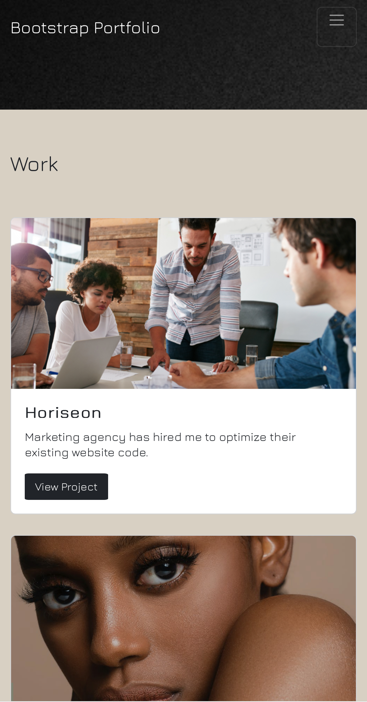
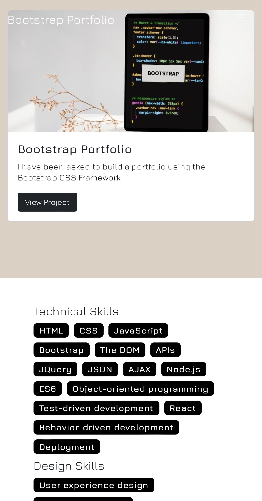
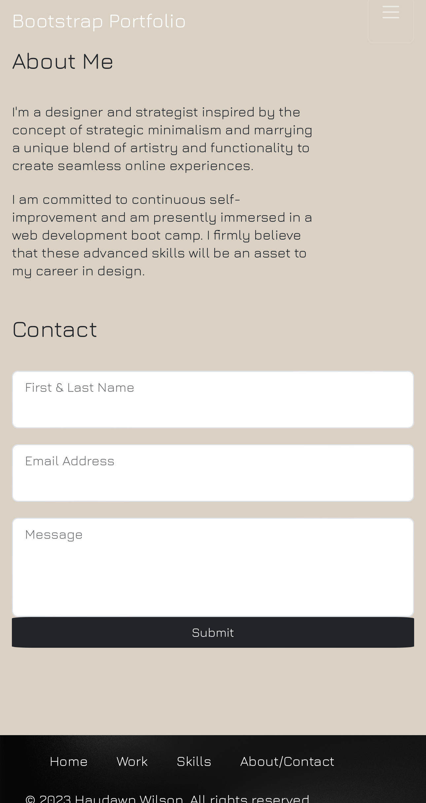

# Bootstrap-Portfolio

## Description 
Portfolio page using Bootstrap

## Desktop View

## Mobile Views

  
  
  

## How I approached this Project
As a designer, I wanted to incorporate my existing design skills with my newfound coding skills. With some previous basic knowledge and useful resources below, I wanted to keep my design close to the acceptance criteria but still maintain my signature minimalist style.

## References / Resources
Refer to 
* (https://getbootstrap.com/)
* (https://www.w3schools.com) 

### Image Source
Refer to
* (https://www.pexels.com/)
* (https://www.canva.com/)

## Deployed Project Link 
You can view my Portfolio website via this link - (https://hwilson-hub.github.io/Bootstrap-Portfolio/)

## License

This project is licensed under the MIT License

Permission is hereby granted, free of charge, to any person obtaining a copy
of this software and associated documentation files (the "Software"), to deal
in the Software without restriction, including without limitation the rights
to use, copy, modify, merge, publish, distribute, sublicense, and/or sell
copies of the Software, and to permit persons to whom the Software is
furnished to do so, subject to conditions.

©2023. Haydawn Wilson. All Rights Reserved.

